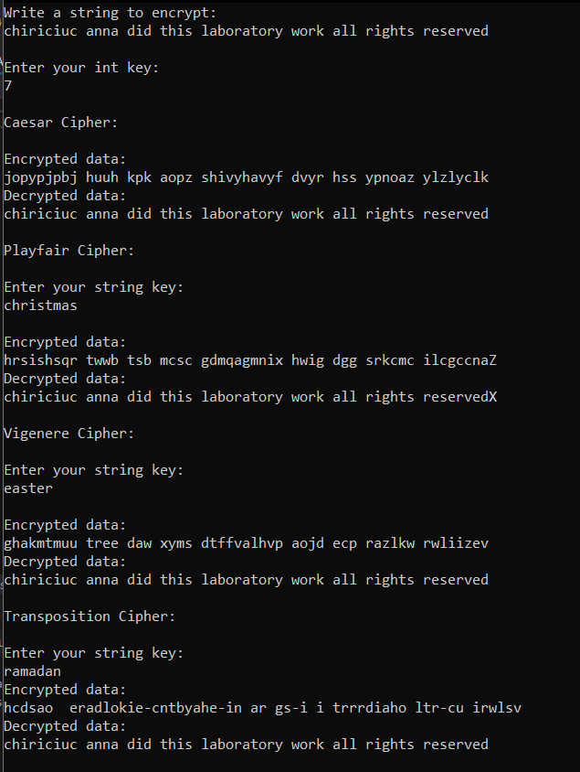

# Lab work 1: Classic Ciphers

### Course: Cryptography & Security
### Author: Anna Chiriciuc

----

## Theory
In this lab work I've implemented classic ciphers.
Caesar Cipher, Vigenere Cipher, Transposition Cipher, Playfair Cipher.

**Caesar Cipher** - it has a key which is used to substitute the characters with the following ones, by the order number in a pre-established alphabet. Mathematically it would be expressed as follows:

Formulas:

* $em = enc_{k}(x) = x + k (mod \; n),$

* $dm = dec_{k}(x) = x + k (mod \; n),$ 

Where:
- em: the encrypted message,
- dm: the decrypted message (i.e. the original one),
- x: input,
- k: key,
- n: size of the alphabet.


**Vigenere Cipher** - is a method of encrypting alphabetic text by using a series of different Caesar ciphers based on the letters of a keyword. It is a simple form of polyalphabetic substitution.
Both the sender and the receiver decide on a string key. Each alphabet of the key is converted to its respective numeric value.

**Transposition Cipher** - This cipher follows a simple rule for mixing up the characters in the plaintext to form the ciphertext. Although this cipher is weak on its own, but it can be combined with other ciphers, such as a substitution cipher, the combination of which can be more difficult to break than either cipher on it's own.

**Playfair Cipher** - is a manual symmetric encryption technique and was the first literal digram substitution cipher. 
In playfair cipher, initially a key table is created. The key table is a 5×5 grid of alphabets that acts as the key for encrypting the plaintext. Each of the 25 alphabets must be unique and one letter of the alphabet (usually J) is omitted from the table as we need only 25 alphabets instead of 26. If the plaintext contains J, then it is replaced by I.

The sender and the receiver decide on a particular key, say 'Algorithm'. In a key table, the first characters (going left to right) in the table is the phrase, excluding the duplicate letters. The rest of the table will be filled with the remaining letters of the alphabet, in natural order. 

## Objectives:

* In this lab work every cipher had been implemented in C# language using a console app .NET 5 version. You need to run this code and follow the instructions.
* I've got familiar with cryptography basics and its classical ciphers. Instead of Ceasar Cipher with permutation I've implemented a Transposition Cipher.


## Implementation description

* In this laboratory work I've implemented 4 types of ciphers: Caesar, Vigenere, Playfair and Transposition Cipher. Code snippets are followed by description.
Theory can be found in respective section of this report.


In this class I've implemented a classic cipher - Caesar Cipher.

En(x)=(x+n) mod 26   - encryption phase with shift n
Dn(x)=(x-n) mod 26   - decryption phase with shift n

As an input we have a string. As a key - an integer for respective shift.
Then we traverse the given text one character a time, transform as per rule our alphabet, return new string. Reverse for decryption.


```
    public class CaesarCipher
    {
        public static char Cipher(char c, int key)
        {
            if (!char.IsLetter(c))
            {
                return c;
            }

            char d = char.IsUpper(c) ? 'A' : 'a';
            return (char)(((c + key - d) % 26) + d);
        }

        public static string Encryption(string input, int key)
        {
            string output = "";

            foreach (char c in input)
            {
                output += Cipher(c, key);
            }

            return output;
        }

        public static string Decryption(string input, int key)
        {
            return Encryption(input, 26 - key);
        }
    }
```

**Playfair Cipher** - First, a plaintext message is split into pairs of two letters (digraphs). If there is an odd number of letters, a Z is added to the last letter. Let us say we want to encrypt the message "Programming". It will be written as - Pr og ra mm in gZ
The rules of encryption are -
​If both the letters are in the same column, take the letter below each one (going back to the top if at the bottom)​
If both letters are in the same row, take the letter to the right of each one (going back to the left if at the farthest right)
If neither of the preceding two rules are true, form a rectangle with the two letters and take the letters on the horizontal opposite corner of the rectangle.
​Using these rules, the result of the encryption of 'Programming' with the key of 'Algorithm' would be − UlroalkkcvhG

Decrypting the Playfair cipher is as simple as doing the same process in reverse. Receiver has the same key and can create the same key table, and then decrypt any messages made using that key.

```
   private static int Mod(int a, int b)
        {
            return (a % b + b) % b;
        }

        private static List<int> FindAllOcurences(string s, char value)
        {
            List<int> indexes = new List<int>();

            int index = 0;

            while ((index = s.IndexOf(value, index)) != -1)
                indexes.Add(index++);

            return indexes;
        }

        private static string RemoveAllDuplicates(string s, List<int> indexes)
        {
            string returnValue = s;

            for (int i = indexes.Count - 1; i >= 1; i--)
            {
                returnValue = returnValue.Remove(indexes[i], 1);
            }
            return returnValue;
        }

        private static char[,] GenerateKeySquare(string key)
        {
            char[,] keySquare = new char[5, 5];
            string defaultKeySquare = "ABCDEFGHIKLMNOPQRSTUVWXYZ";
            string temporaryKey = string.IsNullOrEmpty(key) ? "CIHPER" : key.ToUpper();

            temporaryKey = temporaryKey.Replace("J", "");
            temporaryKey += defaultKeySquare;

            for (int i = 0; i < 25; ++i)
            {
                List<int> indexes = FindAllOcurences(temporaryKey, defaultKeySquare[i]);
                temporaryKey = RemoveAllDuplicates(temporaryKey, indexes);
            }

            temporaryKey = temporaryKey.Substring(0, 25);

            for (int i = 0; i < 25; i++)
            {
                keySquare[(i / 5), (i % 5)] = temporaryKey[i];
            }
            return keySquare;
        }

        private static void GetPosition(ref char[,] keySquare, char ch, ref int row, ref int col)
        {
            if (ch == 'J')
            {
                GetPosition(ref keySquare, 'I', ref row, ref col);
            }

            for (int i = 0; i < 5; i++)
            {
                for (int j = 0; j < 5; j++)
                {
                    if (keySquare[i, j] == ch)
                    {
                        row = i;
                        col = j;
                    }
                }
            }
        }

        private static char[] SameRow(ref char[,] keySquare,
                                     int row, int col1, int col2, int encipher)
        {
            return new char[] {keySquare[row, Mod((col1 + encipher), 5)],
                keySquare[row, Mod((col2 + encipher), 5)]};
        }

        private static char[] SameColumn(ref char[,] keySquare, int col, int row1, int row2, int encipher)
        {
            return new char[] { keySquare[Mod((row1 + encipher), 5), col],
                keySquare[Mod((row2 + encipher), 5), col] };
        }

        private static char[] SameRowColumn(ref char[,] keySquare, int row, int col, int encipher)
        {
            return new char[] { keySquare[Mod((row + encipher), 5),
                Mod((col + encipher), 5)], keySquare[Mod((row + encipher), 5), Mod((col + encipher), 5)] };
        }

        private static char[] DifferentRowColumn(ref char[,] keySquare, int row1, int col1, int row2, int col2)
        {
            return new char[] { keySquare[row1, col2],
                keySquare[row2, col1] };
        }


        private static string RemoveOtherChars(string input)
        {
            string output = input;

            for (int i = 0; i < output.Length; ++i)
                if (!char.IsLetter(output[i]))
                    output = output.Remove(i, 1);

            return output;
        }

        private static string AdjustOutput(string input, string output)
        {
            StringBuilder retVal = new StringBuilder(output);

            for (int i = 0; i < input.Length; ++i)
            {
                if (!char.IsLetter(input[i]))
                    retVal = retVal.Insert(i, input[i].ToString());

                if (char.IsLower(input[i]))
                    retVal[i] = char.ToLower(retVal[i]);
            }

            return retVal.ToString();
        }

        private static string Cipher(string input, string key, bool encipher)
        {
            string retVal = string.Empty;
            char[,] keySquare = GenerateKeySquare(key);
            string tempInput = RemoveOtherChars(input);
            int e = encipher ? 1 : -1;

            if ((tempInput.Length % 2) != 0)
                tempInput += "X";

            for (int i = 0; i < tempInput.Length; i += 2)
            {
                int row1 = 0;
                int col1 = 0;
                int row2 = 0;
                int col2 = 0;

                GetPosition(ref keySquare, char.ToUpper(tempInput[i]), ref row1, ref col1);
                GetPosition(ref keySquare, char.ToUpper(tempInput[i + 1]), ref row2, ref col2);

                if (row1 == row2 && col1 == col2)
                {
                    retVal += new string(SameRowColumn(ref keySquare, row1, col1, e));
                }
                else if (row1 == row2)
                {
                    retVal += new string(SameRow(ref keySquare, row1, col1, col2, e));
                }
                else if (col1 == col2)
                {
                    retVal += new string(SameColumn(ref keySquare, col1, row1, row2, e));
                }
                else
                {
                    retVal += new string(DifferentRowColumn(ref keySquare, row1, col1, row2, col2));
                }
            }

            retVal = AdjustOutput(input, retVal);

            return retVal;
        }

        public static string Encipher(string input, string key)
        {
            return Cipher(input, key, true);
        }

        public static string Decipher(string input, string key)
        {
            return Cipher(input, key, false);
        }

    }
```

**Vigenere Cipher** - Now if suppose your plaintext is a long string, then you have to extend your key to the plaintext. As you can see the key is repeated, it will be similar in size to that of plaintext like above. Now you have to divide the result into 5 letter blocks. 
To encrypt the following plaintext and its corresponding letter, we have to use it above a 26X26 matrix, use the keyword letter and plaintext letter as the row index and column index, and the entry where row and column intersect is the letter of Ciphertext to that particular letter of plaintext.

```

        private static int Mod(int a, int b)
        {
            return (a % b + b) % b;
        }

        private static string Cipher(string input, string key, bool encipher)
        {
            for (int i = 0; i < key.Length; ++i)
                if (!char.IsLetter(key[i]))
                    return null; // Error

            string output = string.Empty;
            int nonAlphaCharCount = 0;

            for (int i = 0; i < input.Length; ++i)
            {
                if (char.IsLetter(input[i]))
                {
                    bool cIsUpper = char.IsUpper(input[i]);
                    char offset = cIsUpper ? 'A' : 'a';
                    int keyIndex = (i - nonAlphaCharCount) % key.Length;
                    int k = (cIsUpper ? char.ToUpper(key[keyIndex]) : char.ToLower(key[keyIndex])) - offset;
                    k = encipher ? k : -k;
                    char ch = (char)((Mod(((input[i] + k) - offset), 26)) + offset);
                    output += ch;
                }

                else
                {
                    output += input[i];
                    ++nonAlphaCharCount;
                }
            }
            return output;
        }

        public static string Encipher(string input, string key)
        {
            return Cipher(input, key, true);
        }

        public static string Decipher(string input, string key)
        {
            return Cipher(input, key, false);
        }
    }
```

**Transposition Cipher**: using a matrix. The plain text characters are placed horizontally and the cipher text is created with vertical format. Then we mix the rows and columns.

```
   private static int[] GetShiftIndexes(string key)
        {
            int keyLength = key.Length;
            int[] indexes = new int[keyLength];
            List<KeyValuePair<int, char>> sortedKey = new List<KeyValuePair<int, char>>();
            int i;

            for (i = 0; i < keyLength; ++i)
                sortedKey.Add(new KeyValuePair<int, char>(i, key[i]));

            sortedKey.Sort(
                delegate (KeyValuePair<int, char> pair1, KeyValuePair<int, char> pair2)
                {
                    return pair1.Value.CompareTo(pair2.Value);
                }
            );

            for (i = 0; i < keyLength; ++i)
                indexes[sortedKey[i].Key] = i;

            return indexes;
        }


        public static string Encipher(string input, string key, char padChar)
        {
            input = (input.Length % key.Length == 0) ? input : input.PadRight(input.Length - (input.Length % key.Length) + key.Length, padChar);
            StringBuilder output = new StringBuilder();
            int totalChars = input.Length;
            int totalColumns = key.Length;
            int totalRows = (int)Math.Ceiling((double)totalChars / totalColumns);
            char[,] rowChars = new char[totalRows, totalColumns];
            char[,] colChars = new char[totalColumns, totalRows];
            char[,] sortedColChars = new char[totalColumns, totalRows];
            int currentRow, currentColumn, i, j;
            int[] shiftIndexes = GetShiftIndexes(key);

            for (i = 0; i < totalChars; ++i)
            {
                currentRow = i / totalColumns;
                currentColumn = i % totalColumns;
                rowChars[currentRow, currentColumn] = input[i];
            }

            for (i = 0; i < totalRows; ++i)
                for (j = 0; j < totalColumns; ++j)
                    colChars[j, i] = rowChars[i, j];

            for (i = 0; i < totalColumns; ++i)
                for (j = 0; j < totalRows; ++j)
                    sortedColChars[shiftIndexes[i], j] = colChars[i, j];

            for (i = 0; i < totalChars; ++i)
            {
                currentRow = i / totalRows;
                currentColumn = i % totalRows;
                output.Append(sortedColChars[currentRow, currentColumn]);
            }

            return output.ToString();
        }

        public static string Decipher(string input, string key)
        {
            StringBuilder output = new StringBuilder();
            int totalChars = input.Length;
            int totalColumns = (int)Math.Ceiling((double)totalChars / key.Length);
            int totalRows = key.Length;
            char[,] rowChars = new char[totalRows, totalColumns];
            char[,] colChars = new char[totalColumns, totalRows];
            char[,] unsortedColChars = new char[totalColumns, totalRows];
            int currentRow, currentColumn, i, j;
            int[] shiftIndexes = GetShiftIndexes(key);

            for (i = 0; i < totalChars; ++i)
            {
                currentRow = i / totalColumns;
                currentColumn = i % totalColumns;
                rowChars[currentRow, currentColumn] = input[i];
            }

            for (i = 0; i < totalRows; ++i)
                for (j = 0; j < totalColumns; ++j)
                    colChars[j, i] = rowChars[i, j];

            for (i = 0; i < totalColumns; ++i)
                for (j = 0; j < totalRows; ++j)
                    unsortedColChars[i, j] = colChars[i, shiftIndexes[j]];

            for (i = 0; i < totalChars; ++i)
            {
                currentRow = i / totalRows;
                currentColumn = i % totalRows;
                output.Append(unsortedColChars[currentRow, currentColumn]);
            }

            return output.ToString();
        }
    **}**
```

## Conclusions / Screenshots / Results

As a result we obtain this:
