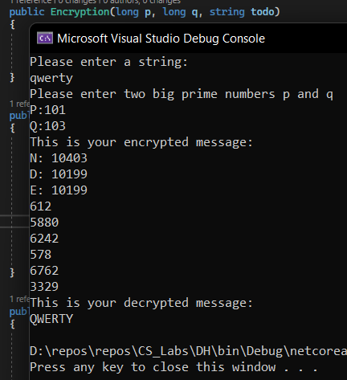

# Lab work 3: Asymmetric Ciphers.

### Course: Cryptography & Security
### Author: Anna Chiriciuc

---

## Theory

In this lab work I've implemented the RSA algorithm. 

RSA algorithm is an asymmetric cryptography algorithm. Asymmetric actually means that it works on two different keys i.e. Public Key and Private Key. As the name describes that the Public Key is given to everyone and the Private key is kept private.

For example, a client (browser) sends its public key to the server and requests some data;
The server encrypts the data using the client's public key and sends the encrypted data;
The client receives this data and encrypts it.

Since this is an asymetric encryption/decryption process, nobody except the browser can decrypt the data even if a third party has the public key of the browser.

The idea behind RSA is:

The Public Key consists of two numbers where one number is a multiplication of two prime numbers, denoted as N in this lab work.
And private key is also derived from the same two prime numbers. So, if someone can factorize the large number, the private key is compromised.
Therefore, the encryption strendth totally depends on the key size and if we double of triple the key size, the strength of encryption increases exponentially.
RSA can be typically 1024 or 2048 bits long, but experts believe that 1-24-bit keys could be broken in the near future. But till now it seems to be an infeasible task.

You can find the algorithm down in this document with code snippets.


## Objectives:

In this lab work I've understood how to create an asymetric cryptography algorithm.

## Implementation description

x is for multiplication

1. Select two prime numbers P and Q;

```
 Console.WriteLine("Please enter two big prime numbers p and q");
Console.Write("P:");
long p = Convert.ToInt64(Console.ReadLine());
Console.Write("Q:");
long q = Convert.ToInt64(Console.ReadLine());
```

Check if they are prime:
```
public bool IsSimple(long n)
        {
            if (n < 2)
            {
                return false;
            }

            if (n == 2)
            {
                return true;
            }

            for (long i = 2; i < n; i++)
            {
                if (n % i == 0)
                    return false;
            }

            return true;
        }
```

2. Compute: n=pxq, m=(p-1)x(q-1);

```
n = p * q;
m = (p - 1) * (q - 1);
```


3. Choose a number d, mutually prime with m;

```
public long CalculateD(long m)
        {
            long d = m - 1;
            for (long i = 2; i <= m; i++)
            {
                if ((m % i == 0) && (d % i == 0))
                {
                    d--;
                    i = 1;
                }
            }

            return d;
        }

```


5. Find such a number e that this equation remains true: (exd)mod(m)=1;


```
public long CalculateE(long d, long m)
        {
            long e = 10;

            while (true)
            {
                if ((e * d) % m == 1)
                {
                    break;
                }
                else
                {
                    e++;
                }
            }

            return e;
        }
```

Public key: E and N
Private key: D and N

We encipher the message with public key and decipher with the private one.
Private key is kept, obviously, private.

We break down the to-be-enciphered text in blocks, each block equals to one symbol. 
Typically it is written down as a ASCII or Unicode number that represents the letter, number, etc.

The encryption process:
C(i)=(M(i)^e)mod(n);

The decryption process:
M(i)=(C(i)^d)mod(n);

Also I've set the Alphabet characters in a char array so that each character is easy to access and process.
Full code is in the respective repository folder.

## Conclusions / Screenshots / Results

Here are the obtained results:


