# Lab work 3: Asymmetric Ciphers.

### Course: Cryptography & Security
### Author: Anna Chiriciuc

---

## Theory

 Hashing is a technique used to compute a new representation of an existing value, message or any piece of text. The new representation is also commonly called a digest of the initial text, and it is a one way function meaning that it should be impossible to retrieve the initial content from the digest.

 Hashed passwords cannot be modified, stolen, or jeopardized. No well-recognized and efficient key or encryption scheme exists that can be misused. Also, there is no need to worry if a hash code is stolen since it cannot be applied anywhere else.

 Application of Hashing:

Password Verification
Compiler Operation
Rabin-Karp Algorithm
Data Structures
Message Digest

## Objectives:

1. Get familiar with the hashing techniques/algorithms.
2. Use an appropriate hashing algorithms to store passwords in a local DB.
3. Use an asymmetric cipher to implement a digital signature process for a user message.

a. Take the user input message.
b. Preprocess the message, if needed.
c. Get a digest of it via hashing.
d. Encrypt it with the chosen cipher.
e. Perform a digital signature check by comparing the hash of the message with the decrypted one.

## Implementation description

In this lab work I've created a web application that has in-built database of users.
These operations are available: register a user, login, get the message to be encrypted, verify it and create refresh tokens.

In order to omit lots of code, I'll explain the structure. I have implemented necessary controllers for the requests mentioned earlier, DTOs with necessary properties for json object creation/deserialization and specific methods for password and message hashing.

JWTs (JSON Web Tokens) are credentials, which can grant access to resources.
I used JWTs in order to transfer the data for authentication purposes in this client-server app.
They are created at the server's side, then signed with a private key and transmitted over to the client's side,
which lated uses it for user validation. These two snippets illustrate their initialization:

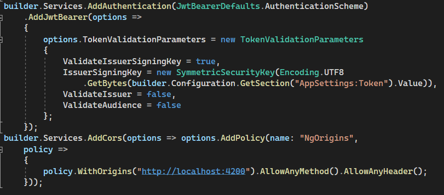

and

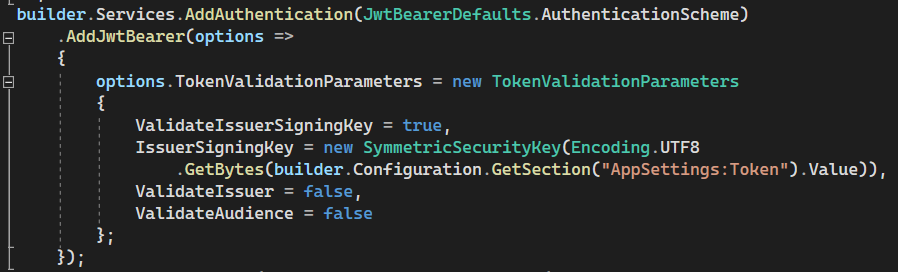

Let's dive into more details. Code with DTOs and interfaces can be found in the lab folder.

This is the Token DTO with attributed creation/expiration time.

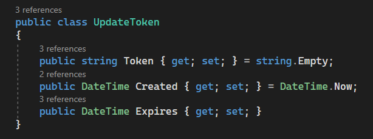

Now I'll explain the controller which holds the most important part. For full code, please see the AuthController.cs file.
User registration, password hash and salt creation using SHA256 + Salt.
SHA256 is designed by NSA, it's more reliable than SHA1. With the GDPR you have to pseudonymize personally identifiable information (PII), or sensitive personal information (SPI), you are processing. 
The hash rule is: hash = SHA256(SALT(STRING)+STRING).
please mind that STRING is case sensitive!

Here's the login part that searches for user, verifies whether the password is correct and creates an access token for user authorization.
Depending on the incoming data, user will be not found or the password will be wrong or successfully logged in.

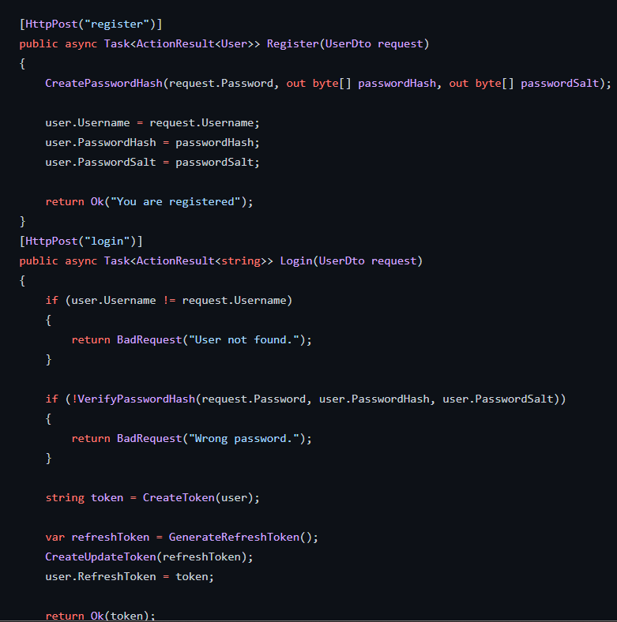

Here the password hash is verified.

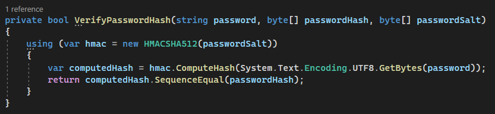

This task is used to show whether the tokens match, not expired and fully function.
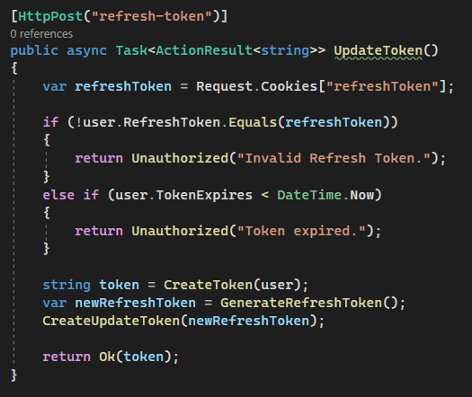

Token creation:

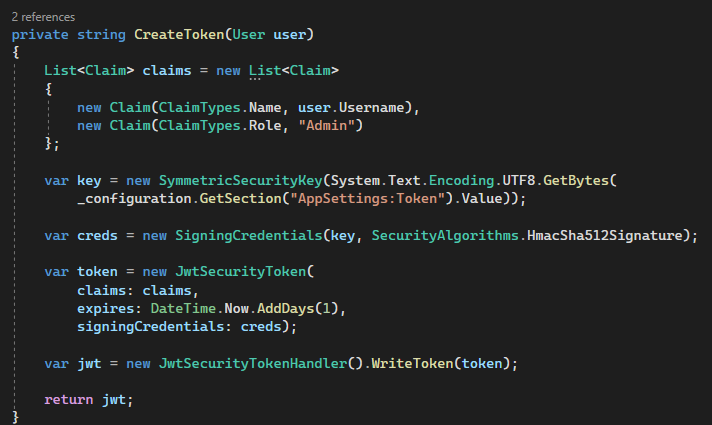
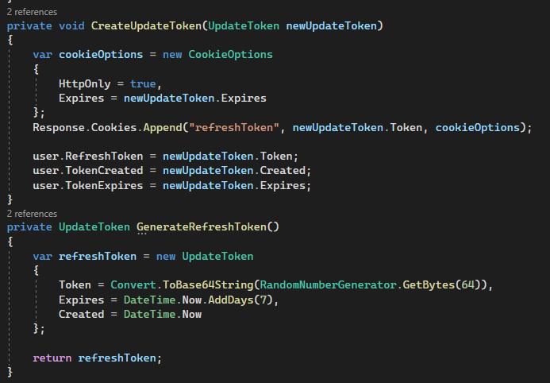

This method gets the input and verifies the created token. If it matches, 200 code is returned.
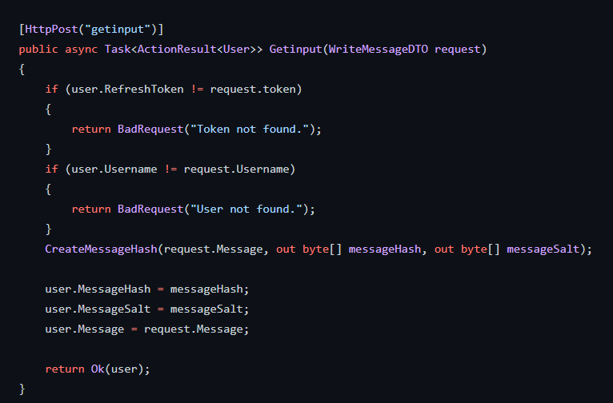

Here the message is being checked. If message hash/salt isn't matching, then it is not shown.
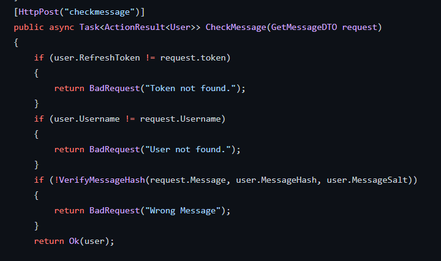

Message hash creation and validation methods:
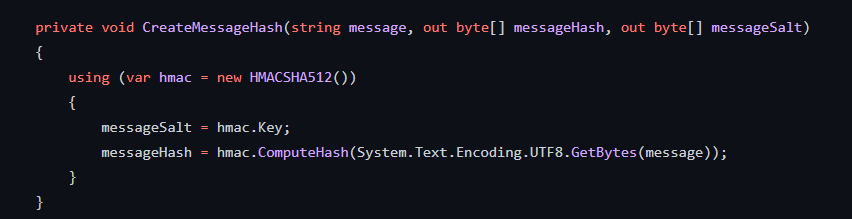
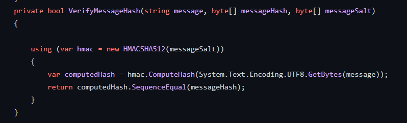

## Conclusions / Screenshots / Results

Here you can see the "workflow" of th application.
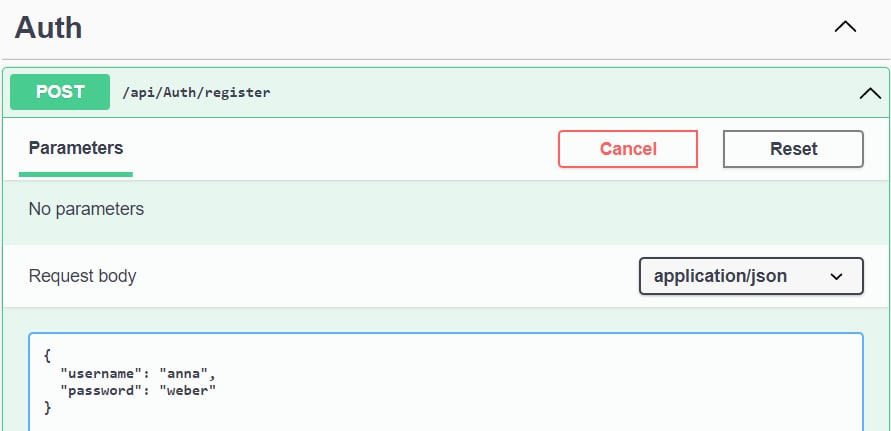
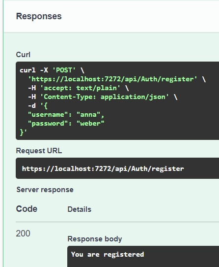
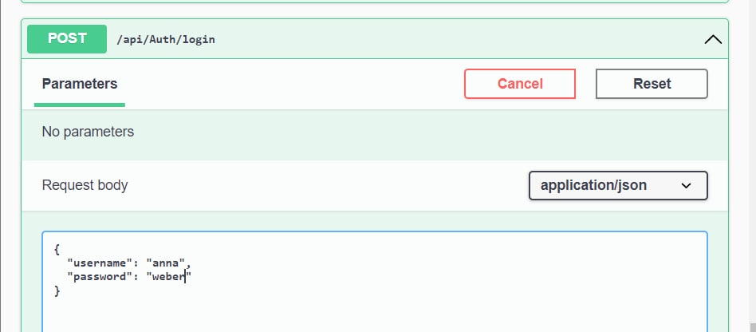
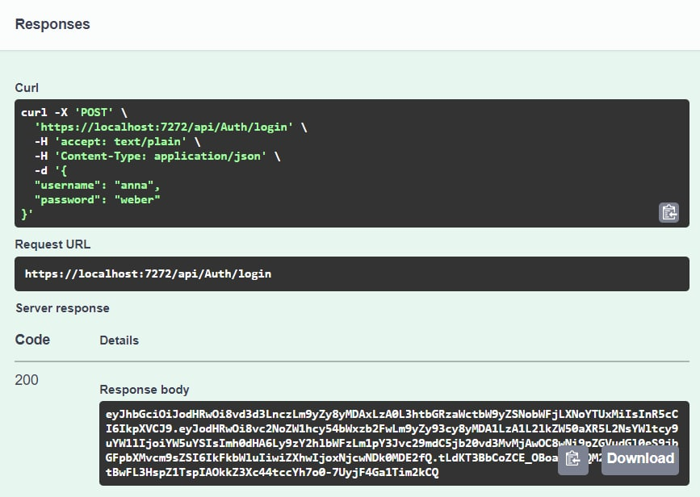
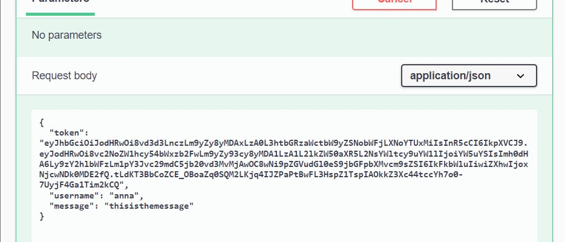
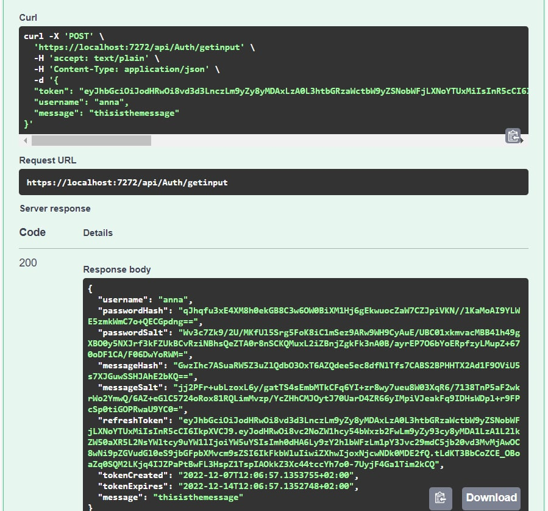
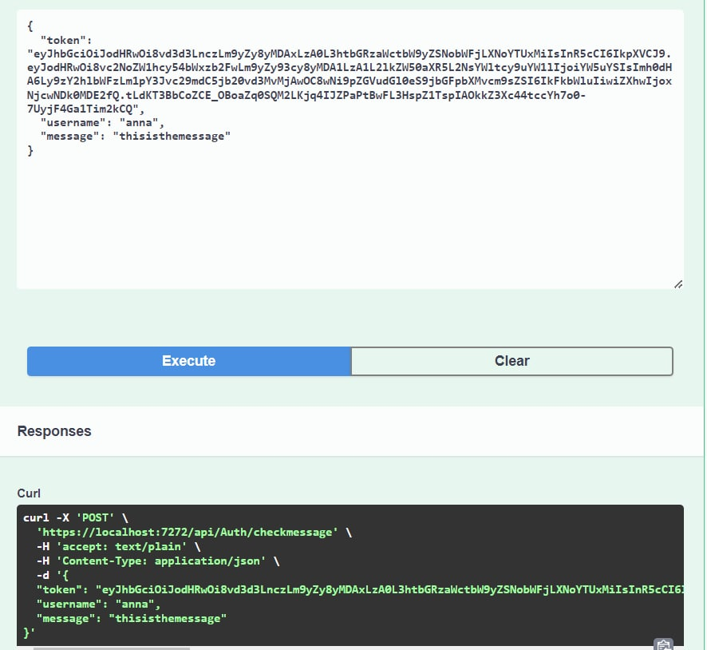

As a result we see that generated hash matches and everything works correctly. I used an appropriate hashing algorithms to store passwords and messages in a in-memory DB.
Also I've used an asymmetric cipher to implement a digital signature process for a user password and message.