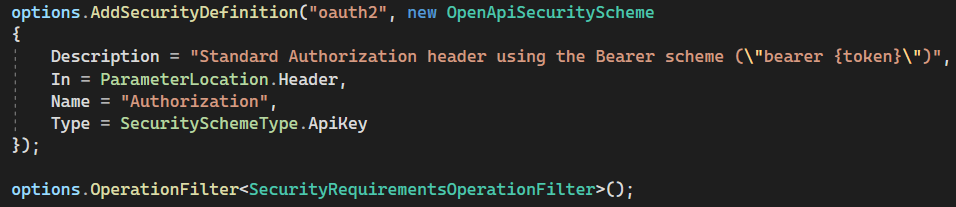
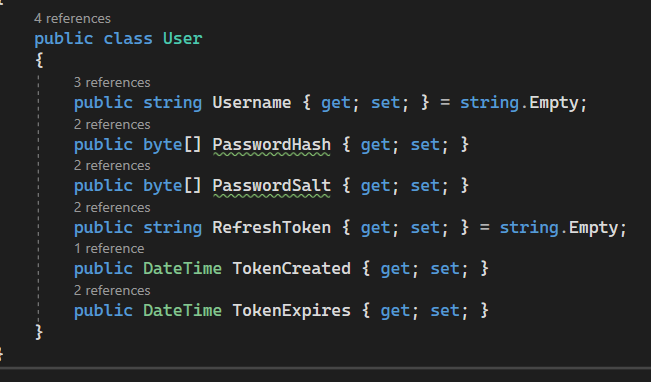
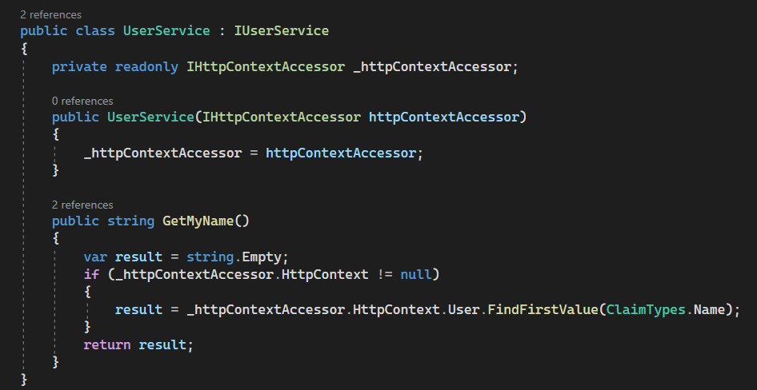
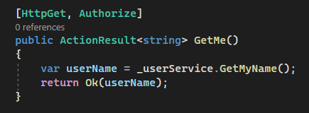
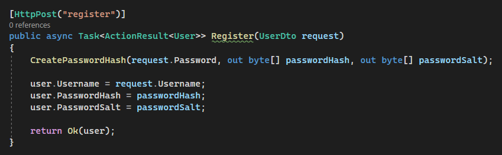
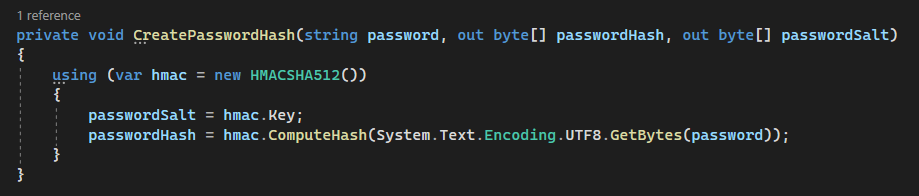
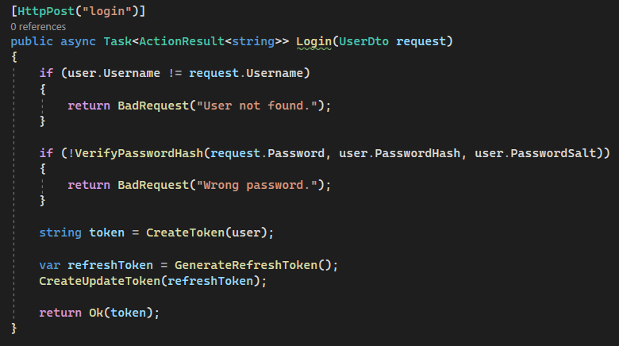
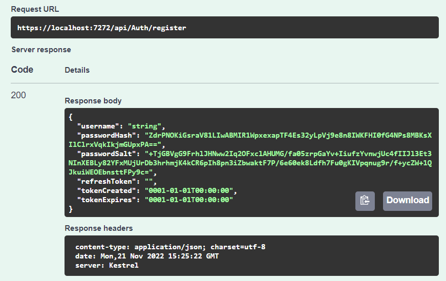
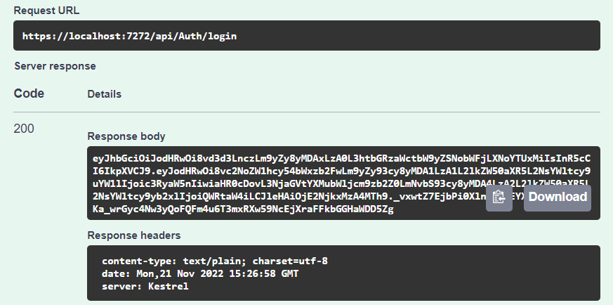
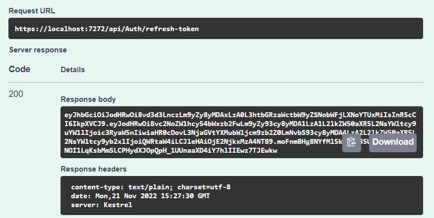

# Lab work 3: Asymmetric Ciphers.

### Course: Cryptography & Security
### Author: Anna Chiriciuc

---

## Theory

 Hashing is a technique used to compute a new representation of an existing value, message or any piece of text. The new representation is also commonly called a digest of the initial text, and it is a one way function meaning that it should be impossible to retrieve the initial content from the digest.

 Hashed passwords cannot be modified, stolen, or jeopardized. No well-recognized and efficient key or encryption scheme exists that can be misused. Also, there is no need to worry if a hash code is stolen since it cannot be applied anywhere else.

 Application of Hashing:

Password Verification
Compiler Operation
Rabin-Karp Algorithm
Data Structures
Message Digest

## Objectives:

1. Get familiar with the hashing techniques/algorithms.
2. Use an appropriate hashing algorithms to store passwords in a local DB.
3. Use an asymmetric cipher to implement a digital signature process for a user message.

a. Take the user input message.
b. Preprocess the message, if needed.
c. Get a digest of it via hashing.
d. Encrypt it with the chosen cipher.
e. Perform a digital signature check by comparing the hash of the message with the decrypted one.

## Implementation description

In this lab work I've created a web service with autentication 

JWTs (JSON Web Tokens) are credentials, which can grant access to resources.
I used JWTs in order to transfer the data for authentication purposes in this client-server app.
They are created at the server's side, then signed with a private key and transmitted over to the client's side,
which lated uses it for user validation. These two snippets illustrate their initialization:

and

Let's dive into more details.

This is the User Data Transfer Object that contains user's necessary properties. It is also used in an asyncronous Task of Registration and Authorization of User.

Here I implement an abstract interface to get the user by name.

This is the Token DTO with attributed creation/expiration time.

Now I'll explain the controller which holds the most important part. For full code, please see the AuthController.cs file.
User authorization:

SHA256 is designed by NSA, it's more reliable than SHA1. With the GDPR you have to pseudonymize personally identifiable information (PII), or sensitive personal information (SPI), you are processing. 
The hash rule is: hash= SHA256(SALT(STRING)+STRING).
please mind that STRING is case sensitive!
Here the user's hased password is created using SHA256 + Salt.

Here's the login part that searches for user, verifies whether the password is correct and creates an access token for user authorization.

This task is used to show whether the tokens match, not expired and fully function.

Token creation:

## Conclusions / Screenshots / Results

As a result we see that generated hash matches and everything works correctly. I used an appropriate hashing algorithms to store passwords in a in-memory DB.
Also I've used an asymmetric cipher to implement a digital signature process for a user password.